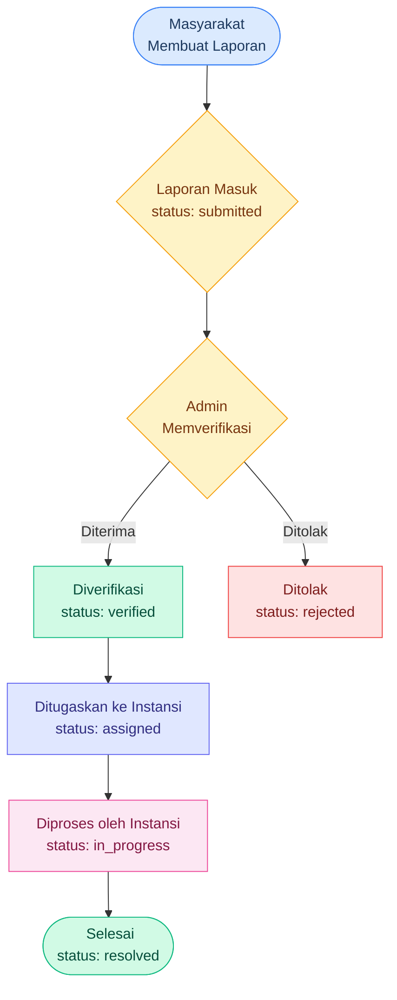
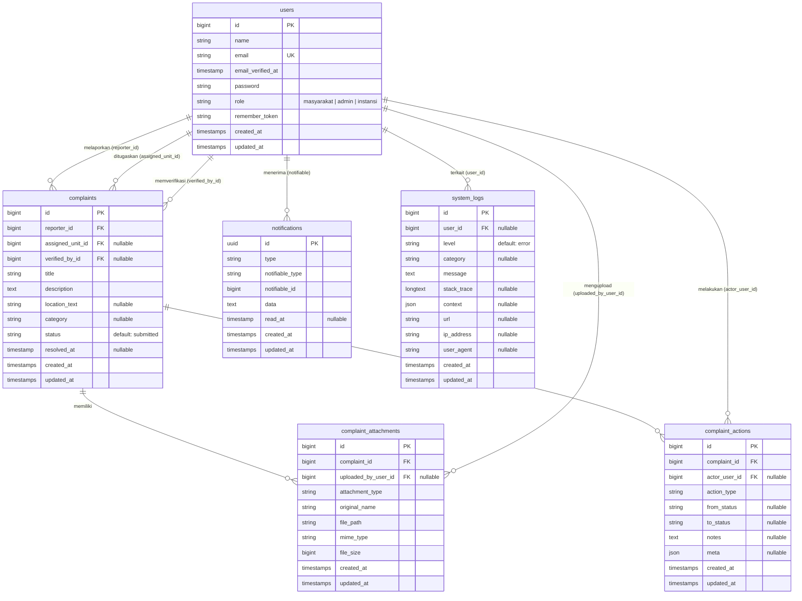

<!-- markdownlint-disable MD033 -->
<!-- markdownlint-disable MD041 -->
<p align="center">
  
  
  
  
  
</p>


<h1 align="center">️ SiMPeKat</h1>
<h3 align="center">Sistem Manajemen Pengaduan Masyarakat</h3>

<p align="center">
  Aplikasi web berbasis Laravel untuk memfasilitasi masyarakat dalam menyampaikan pengaduan<br>
  kepada pemerintah secara transparan, terstruktur, dan dapat dipantau.
</p>

---

## Daftar Isi

- [Daftar Isi](#daftar-isi)
- [Informasi Akademik](#informasi-akademik)
- [Analisis Masalah](#analisis-masalah)
  - [Latar Belakang Masalah](#latar-belakang-masalah)
  - [Rumusan Masalah](#rumusan-masalah)
  - [Tujuan](#tujuan)
  - [Solusi yang Ditawarkan](#solusi-yang-ditawarkan)
- [Tentang Proyek](#tentang-proyek)
  - [Fitur Utama](#fitur-utama)
- [Fitur Unggulan](#fitur-unggulan)
- [Peran Pengguna](#peran-pengguna)
- [Alur Kerja Laporan](#alur-kerja-laporan)
  - [Tabel Status Laporan](#tabel-status-laporan)
- [️Skema Database (ERD)](#️skema-database-erd)
- [️Teknologi yang Digunakan](#️teknologi-yang-digunakan)
  - [Backend](#backend)
  - [Frontend](#frontend)
  - [Development Tools](#development-tools)
- [Prasyarat](#prasyarat)
- [Cara Instalasi](#cara-instalasi)
  - [1. Clone Repositori](#1-clone-repositori)
  - [2. Install Dependensi](#2-install-dependensi)
  - [3. Konfigurasi Environment](#3-konfigurasi-environment)
  - [4. Siapkan Database](#4-siapkan-database)
  - [5. Seed Data Demo (Opsional)](#5-seed-data-demo-opsional)
  - [6. Build Asset Frontend](#6-build-asset-frontend)
- [️Konfigurasi Lingkungan](#️konfigurasi-lingkungan)
- [Menjalankan Aplikasi](#menjalankan-aplikasi)
  - [Mode Development (Direkomendasikan)](#mode-development-direkomendasikan)
  - [Mode Manual](#mode-manual)
- [Kredensial Demo](#kredensial-demo)
  - [Admin](#admin)
  - [Instansi](#instansi)
  - [Masyarakat](#masyarakat)
- [Screenshot](#screenshot)
  - [Halaman Login](#halaman-login)
  - [Dashboard Masyarakat](#dashboard-masyarakat)
  - [Form Buat Laporan](#form-buat-laporan)
  - [Dashboard Admin — Verifikasi Laporan](#dashboard-admin--verifikasi-laporan)
  - [Dashboard Instansi — Tindak Lanjut](#dashboard-instansi--tindak-lanjut)
  - [Detail Laporan](#detail-laporan)
  - [Notifikasi](#notifikasi)
- [️Struktur Proyek](#️struktur-proyek)
- [Menjalankan Pengujian](#menjalankan-pengujian)
- [‍Tim Pengembang](#tim-pengembang)
- [Lisensi](#lisensi)

---

## Informasi Akademik

| | Keterangan |
| --- | --- |
| **Mata Kuliah** | `Rekayasa Perangkat Lunak` |
| **Dosen Pengampu** | `Moch. Badrus Sholeh, S.Kom., M.Kom.` |
| **Program Studi** | `D4 Manajemen Informatika` |
| **Universitas** | `Universitas Negeri Surabaya` |
| **Semester** | `Semester 2` |

---

## Analisis Masalah

<!-- 
  Silakan isi bagian ini dengan analisis masalah yang melatarbelakangi
  pembuatan aplikasi SiMPeKat. Anda dapat menggunakan format di bawah ini
  atau menulisnya secara bebas.
-->

### Latar Belakang Masalah

Pelayanan publik seringkali terhambat oleh proses penanganan pengaduan yang masih manual, tidak terstruktur, dan kurang transparan. Hal ini menyebabkan keterlambatan dalam verifikasi dan tindak lanjut, serta sulitnya masyarakat dalam memantau perkembangan laporan yang mereka ajukan. Penggunaan sistem informasi digital menjadi kebutuhan mendesak untuk meningkatkan efisiensi, akurasi, dan kepercayaan masyarakat terhadap instansi pelayanan.

### Rumusan Masalah

- Bagaimana memfasilitasi pengajuan pengaduan masyarakat agar lebih mudah dan terstruktur?

- Bagaimana mengoptimalkan proses verifikasi dan tindak lanjut laporan agar lebih efektif?

- Bagaimana menyediakan sistem pemantauan status laporan secara real-time bagi pelapor?

### Tujuan

- Membangun platform yang memudahkan masyarakat dalam menyampaikan pengaduan secara digital.

- Mengembangkan sistem manajemen untuk memproses verifikasi dan disposisi tindak lanjut secara terorganisir.

- Menyediakan fitur monitoring status pengaduan yang transparan dan dapat diakses kapan saja.

### Solusi yang Ditawarkan

**SiMPeKat** (Sistem Manajemen Pengaduan Masyarakat) hadir sebagai solusi digital terintegrasi untuk mentransformasi manajemen pengaduan konvensional menjadi sistem yang lebih responsif. Aplikasi ini menawarkan kemudahan pelaporan berbasis multimedia, percepatan alur verifikasi dan disposisi antar instansi, serta transparansi penuh melalui pelacakan status laporan secara real-time untuk meningkatkan kualitas pelayanan publik secara keseluruhan.

---

## Tentang Proyek

**SiMPeKat** (Sistem Manajemen Pengaduan Masyarakat) adalah aplikasi web yang dirancang untuk mendigitalkan proses pengaduan masyarakat kepada pemerintah. Aplikasi ini menyediakan platform terstruktur bagi masyarakat untuk melaporkan keluhan, bagi admin untuk memverifikasi dan meneruskan laporan, serta bagi instansi terkait untuk menindaklanjuti dan menyelesaikan pengaduan.

### Fitur Utama

| Peran          | Fitur                                                                                                                                                      |
| -------------- | ---------------------------------------------------------------------------------------------------------------------------------------------------------- |
| **Masyarakat** | Membuat laporan pengaduan, melampirkan file bukti (gambar, video, dokumen, audio), memantau status laporan secara real-time, menerima notifikasi pembaruan |
| **Admin**      | Memverifikasi laporan masuk, menerima atau menolak pengaduan, meneruskan laporan ke instansi terkait, mengelola seluruh data pengaduan                     |
| **Instansi**   | Menerima penugasan laporan, memperbarui progres tindak lanjut, menyelesaikan pengaduan, melampirkan bukti penyelesaian                                     |

---

## Fitur Unggulan

- **Sistem Notifikasi Real-Time** — Setiap perubahan status laporan otomatis mengirim notifikasi ke pihak terkait (masyarakat, admin, instansi)
- **Multi-File Attachment** — Mendukung upload berbagai jenis file: gambar, video, audio, dan dokumen (PDF, DOC, dll.) sebagai lampiran bukti
- **Dashboard Dinamis per Peran** — Setiap peran pengguna memiliki tampilan dashboard yang disesuaikan dengan kebutuhannya masing-masing
- **Pelacakan Status Transparan** — Riwayat lengkap setiap tindakan pada laporan tercatat sebagai *audit trail* yang dapat dilihat oleh pelapor
- **️ Sistem Error Handling Robust** — Penanganan error yang komprehensif dengan pesan bilingual (Indonesia untuk error bisnis, Inggris untuk error sistem)
- **Responsive Design** — Antarmuka yang dioptimalkan untuk penggunaan di desktop maupun perangkat mobile
- **Autentikasi & Otorisasi** — Sistem login dengan pembatasan akses berbasis peran (role-based access control)

---

## Peran Pengguna

Aplikasi ini memiliki **3 peran utama** dengan hak akses yang berbeda-beda:

| Peran          | Deskripsi                                     | Hak Akses                                                           |
| -------------- | --------------------------------------------- | ------------------------------------------------------------------- |
| **Masyarakat** | Warga yang ingin menyampaikan pengaduan       | Buat laporan, lihat laporan sendiri, terima notifikasi              |
| **Admin**      | Petugas pemerintah yang memverifikasi laporan | Verifikasi, terima/tolak, teruskan ke instansi, lihat semua laporan |
| **Instansi**   | Unit kerja pemerintah yang menindaklanjuti    | Terima penugasan, update progres, selesaikan laporan                |

---

## Alur Kerja Laporan

Berikut adalah diagram alur pemrosesan laporan pengaduan dalam sistem:



### Tabel Status Laporan

| Status        | Label Indonesia     | Keterangan                                   |
| ------------- | ------------------- | -------------------------------------------- |
| `submitted`   | Menunggu Verifikasi | Laporan baru masuk, belum diverifikasi admin |
| `verified`    | Diverifikasi        | Admin telah memverifikasi laporan            |
| `assigned`    | Ditugaskan          | Laporan telah diteruskan ke instansi terkait |
| `in_progress` | Diproses            | Instansi sedang menindaklanjuti laporan      |
| `resolved`    | Selesai             | Laporan telah selesai ditangani              |
| `rejected`    | Ditolak             | Laporan ditolak oleh admin                   |

---

## ️Skema Database (ERD)

Berikut adalah diagram relasi antar tabel dalam database:



---

## ️Teknologi yang Digunakan

### Backend

| Teknologi      | Versi | Keterangan                     |
| -------------- | ----- | ------------------------------ |
| PHP            | 8.3+  | Bahasa pemrograman server-side |
| Laravel        | 13.x  | Framework PHP utama            |
| Laravel Breeze | 2.x   | Starter kit autentikasi        |
| SQLite         | 3     | Database ringan berbasis file  |

### Frontend

| Teknologi    | Versi | Keterangan                       |
| ------------ | ----- | -------------------------------- |
| Blade        | -     | Template engine bawaan Laravel   |
| Tailwind CSS | 3.x   | Utility-first CSS framework      |
| Alpine.js    | 3.x   | Lightweight JavaScript framework |
| Vite         | 8.x   | Build tool & dev server          |

### Development Tools

| Tools        | Keterangan                          |
| ------------ | ----------------------------------- |
| Composer     | Dependency manager untuk PHP        |
| NPM          | Dependency manager untuk JavaScript |
| Laravel Pint | Code style fixer                    |
| PHPUnit      | Framework unit testing              |
| Laravel Pail | Real-time log viewer                |

---

## Prasyarat

Pastikan perangkat Anda sudah terinstall:

| Software | Versi Minimum | Cara Cek      |
| -------- | ------------- | ------------- |
| PHP      | 8.3           | `php -v`      |
| Composer | 2.x           | `composer -V` |
| Node.js  | 18.x          | `node -v`     |
| NPM      | 9.x           | `npm -v`      |

> **Catatan:** SQLite sudah termasuk dalam instalasi PHP secara default. Pastikan ekstensi `pdo_sqlite` aktif di `php.ini`.

---

## Cara Instalasi

### 1. Clone Repositori

```bash
git clone https://github.com/[username]/sistem-manajemen-pengaduan-masyarakat-2025C.git
cd sistem-manajemen-pengaduan-masyarakat-2025C
```

### 2. Install Dependensi

```bash
composer install
npm install
```

### 3. Konfigurasi Environment

```bash
cp .env.example .env
php artisan key:generate
```

### 4. Siapkan Database

```bash
# Buat file database SQLite (jika belum ada)
# Windows (PowerShell):
New-Item -Path database/database.sqlite -ItemType File -Force

# Linux/macOS:
touch database/database.sqlite

# Jalankan migrasi
php artisan migrate
```

### 5. Seed Data Demo (Opsional)

```bash
php artisan db:seed
```

### 6. Build Asset Frontend

```bash
npm run build
```

> **Shortcut:** Anda juga bisa menjalankan semua langkah di atas sekaligus dengan:

```bash
composer setup
```

---

## ️Konfigurasi Lingkungan

Berikut adalah variabel `.env` penting yang perlu diperhatikan:

| Variabel           | Default            | Keterangan                                    |
| ------------------ | ------------------ | --------------------------------------------- |
| `APP_NAME`         | `Laravel`          | Nama aplikasi, ubah menjadi `SiMPeKat`        |
| `APP_ENV`          | `local`            | Environment: `local`, `staging`, `production` |
| `APP_DEBUG`        | `true`             | Mode debug. **Set ke `false` di production!** |
| `APP_URL`          | `http://localhost` | URL dasar aplikasi                            |
| `DB_CONNECTION`    | `sqlite`           | Driver database yang digunakan                |
| `QUEUE_CONNECTION` | `database`         | Driver antrian untuk notifikasi               |
| `SESSION_DRIVER`   | `database`         | Driver penyimpanan session                    |
| `MAIL_MAILER`      | `log`              | Driver pengiriman email                       |

> ️ **Penting:** Variabel `APP_DEBUG` adalah satu-satunya toggle untuk mengaktifkan/menonaktifkan fitur debug secara keseluruhan (termasuk fitur debug admin). Pastikan bernilai `false` saat deploy ke production.

---

## Menjalankan Aplikasi

### Mode Development (Direkomendasikan)

Perintah berikut akan menjalankan semua service secara bersamaan (server, queue, log viewer, dan Vite):

```bash
composer dev
```

Ini akan menjalankan:

- **Server Laravel** — `php artisan serve` (<http://localhost:8000>)
- **Queue Worker** — `php artisan queue:listen` (untuk memproses notifikasi)
- **Log Viewer** — `php artisan pail` (monitoring log real-time)
- **Vite Dev Server** — `npm run dev` (hot-reload aset frontend)

### Mode Manual

Jika ingin menjalankan masing-masing secara terpisah:

```bash
# Terminal 1 - Server
php artisan serve

# Terminal 2 - Queue (untuk notifikasi)
php artisan queue:listen

# Terminal 3 - Vite (untuk hot-reload CSS/JS)
npm run dev
```

Akses aplikasi di: **<http://localhost:8000>**

---

## Kredensial Demo

Setelah menjalankan `php artisan db:seed`, akun-akun berikut dapat digunakan untuk login:

### Admin

| Nama    | Email               | Password               |
| ------- | ------------------- | ---------------------- |
| Admin 1 | `user1@admin.go.id` | `atadmindotgodotaidi1` |

<!-- Tambahkan akun admin lainnya di sini -->

### Instansi

| Nama            | Email                  | Password                  |
| --------------- | ---------------------- | ------------------------- |
| Unit Instansi 1 | `unit1@instansi.go.id` | `atinstansidotgodotaidi1` |

<!-- Tambahkan akun instansi lainnya di sini -->

### Masyarakat

| Nama                | Email                     | Password        |
| ------------------- | ------------------------- | --------------- |
| Rian Rain           | `Rianrain@fakemail.com`   | `rianismyname`  |
| Clararissa Margaret | `Clararissa@fakemail.com` | `claramybaby90` |

<!-- Tambahkan akun masyarakat lainnya di sini -->

> **Tips:** Anda juga bisa mendaftarkan akun baru melalui halaman registrasi. Akun baru akan otomatis mendapatkan peran **Masyarakat**.

---

## Screenshot

<!-- 
  Ganti placeholder di bawah ini dengan screenshot aplikasi Anda.
  Letakkan file gambar di folder `docs/screenshots/` atau gunakan URL langsung.

  Format:
  
-->

### Halaman Login

> `[Screenshot halaman login]`

### Dashboard Masyarakat

> `[Screenshot dashboard masyarakat]`

### Form Buat Laporan

> `[Screenshot form pembuatan laporan]`

### Dashboard Admin — Verifikasi Laporan

> `[Screenshot dashboard admin]`

### Dashboard Instansi — Tindak Lanjut

> `[Screenshot dashboard instansi]`

### Detail Laporan

> `[Screenshot detail laporan]`

### Notifikasi

> `[Screenshot halaman notifikasi]`

---

## ️Struktur Proyek

```txt
sistem-manajemen-pengaduan-masyarakat-2025C/
│
├── app/                          # Kode inti aplikasi
│   ├── Http/
│   │   ├── Controllers/
│   │   │   ├── Admin/
│   │   │   │   └── DebugController.php         # Fitur debug khusus admin
│   │   │   ├── Auth/                           # Controller autentikasi (Breeze)
│   │   │   ├── AssignmentFollowUpController.php # Tindak lanjut oleh instansi
│   │   │   ├── ComplaintController.php          # CRUD laporan pengaduan
│   │   │   ├── DashboardController.php          # Dashboard per peran
│   │   │   ├── NotificationController.php       # Manajemen notifikasi
│   │   │   ├── ProfileController.php            # Profil pengguna
│   │   │   └── VerificationController.php       # Verifikasi laporan oleh admin
│   │   ├── Middleware/
│   │   │   ├── DynamicSessionTimeout.php        # Timeout session dinamis
│   │   │   ├── EnsureUserRole.php               # Pembatasan akses berdasarkan peran
│   │   │   └── HandleAccountRoleUrl.php         # Routing URL berdasarkan akun/peran
│   │   └── Requests/                            # Form request validation
│   ├── Models/
│   │   ├── Complaint.php             # Model laporan pengaduan
│   │   ├── ComplaintAction.php       # Model riwayat aksi + auto-notifikasi
│   │   ├── ComplaintAttachment.php   # Model lampiran file
│   │   ├── Notification.php          # Model notifikasi kustom
│   │   ├── SystemLog.php             # Model log sistem
│   │   └── User.php                  # Model pengguna (3 peran)
│   ├── Notifications/                # Notification classes
│   ├── Providers/                    # Service providers
│   └── View/                         # View composers/components
│
├── database/
│   ├── migrations/                   # Skema tabel database
│   ├── seeders/
│   │   └── DatabaseSeeder.php        # Seed data akun demo
│   └── database.sqlite               # File database SQLite
│
├── resources/
│   ├── views/
│   │   ├── admin/                    # View khusus admin
│   │   ├── auth/                     # View autentikasi (login, register)
│   │   ├── complaints/               # View laporan pengaduan
│   │   ├── components/               # Blade components reusable
│   │   ├── errors/                   # Halaman error kustom
│   │   ├── instansi/                 # View khusus instansi
│   │   ├── layouts/                  # Layout utama aplikasi
│   │   ├── notifications/            # View notifikasi
│   │   ├── profile/                  # View profil pengguna
│   │   └── dashboard.blade.php       # Halaman dashboard utama
│   ├── css/                          # Stylesheet sumber
│   └── js/                           # JavaScript sumber
│
├── routes/
│   ├── web.php                       # Routing utama aplikasi
│   ├── auth.php                      # Routing autentikasi
│   └── console.php                   # Artisan commands
│
├── public/                           # Aset publik (entry point web server)
├── config/                           # File konfigurasi Laravel
├── storage/                          # File upload, cache, dan log
├── tests/                            # Unit & feature tests
├── .env.example                      # Template konfigurasi environment
├── composer.json                     # Dependensi PHP
├── package.json                      # Dependensi JavaScript
├── tailwind.config.js                # Konfigurasi Tailwind CSS
└── vite.config.js                    # Konfigurasi Vite
```

---

## Menjalankan Pengujian

```bash
# Jalankan semua test
php artisan test

# Atau via Composer
composer test
```

---

## ‍Tim Pengembang

<!-- 
  Silakan isi tabel di bawah ini dengan data anggota tim Anda.
  Tambahkan atau kurangi baris sesuai jumlah anggota.
-->

| No | Nama | NIM | Peran |
| --- | ------------------ | ------- | ------------------------------------ |
| 1 | `Muhammad Riski` | `25091397078` | `Fullstack Developer & System Architect` |
| 2 | `Nikmal Maulina Arba'ani` | `25091397083` | `Technical Writer & UI Designer` |
| 3 | `Roselle Mustarino Marrethy` | `25091397087` | `Technical Writer & UI Designer` |
| 4 | `Muhammad Rafi Adiwanto` | `25091397090` | `Technical Writer & UI Designer` |
| 5 | `Mokhammad Fahim Imanudin` | `25091397110` | `Technical Writer & UI Designer` |

---

## Lisensi

Proyek ini dilisensikan di bawah [MIT License](https://opensource.org/licenses/MIT).

---

<p align="center">
  Dibuat dengan ️❤️ untuk Tugas Mata Kuliah Rekayasa Perangkat Lunak
</p>
